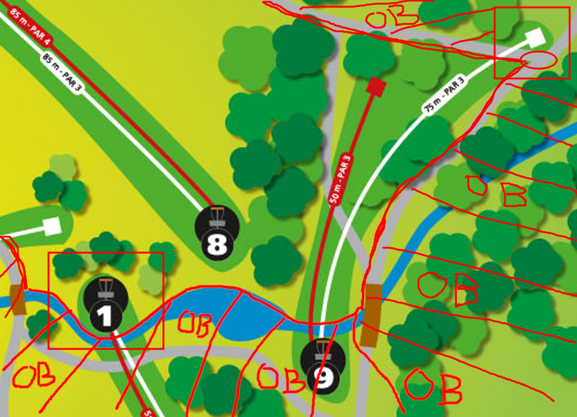
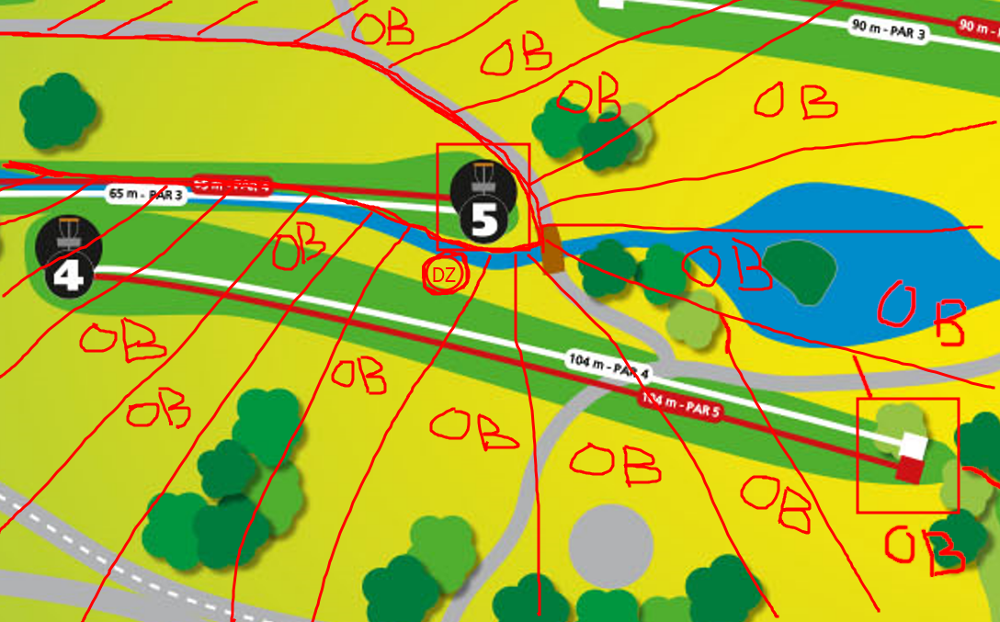
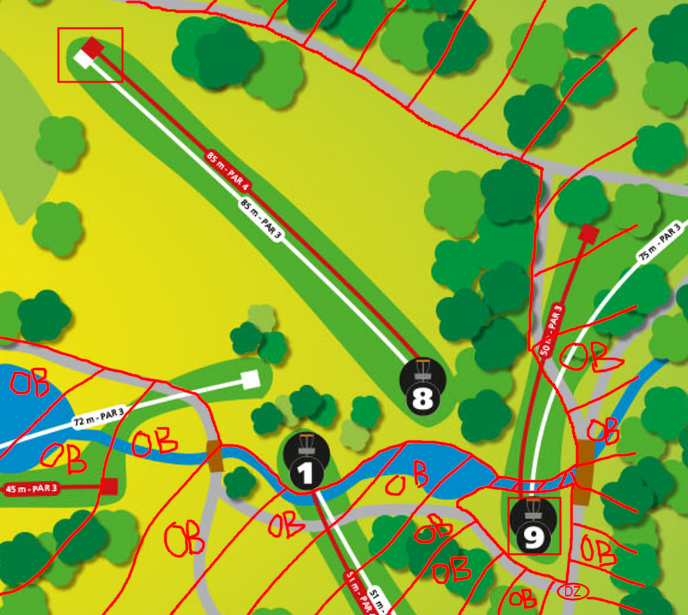

# Fossvogur Gold

## Summary

Fossvogur Gold is an alternate 9 hole layout for the Fossvogur Disc Golf course in Reykjavik. The regular course layout is very beginner friendly and has two sets of tee pads, red and white. For people getting better at the sport there are few choices for more challenging courses. This is an attempt to make a more challenging track for players in Reykjavik and should be good fun for the upcoming intermediate local players in Reykjavik.

## The Course Layout

Fossvogur Gold is a par 30 layout and is roughly 1240 meters or 4068 feet.

The course general flow is that you play from one tee pad to the next basket. During your round you will make two laps of the course.

There is OB everywhere, **ALL WATER IS OB** and there are a bunch of mandatories which should prove difficult for players to navigate.

Missed mandatories are a penalty stroke and the lie is taken within 2m of the missed mandatory.

---

## Hole 1

**Par 3 - 120m**

**Tee Pad 1 >> Basket 2**

---

## Hole 2

**Par 4 - 210m**

**Tee Pad 3 >> Basket 4**

---

## Hole 3

**Par 3 - 180m**

**Tee Pad 5 >> Basket 6**

Here you tee-off from the OB and have to make it to the fairway.

---

## Hole 4

**Par 4 - 175m**

**Tee Pad 7 >> Basket 8**

Here you tee-off from the OB.

First mandatory is the tree on the left side of the gap, you must go on the right side.

Second mandatory is right passed basket 7 and must be passed on the left side.

---

## Hole 5

**Par 3 - 90m**

**Tee Pad 9(OLD WHITE) >> Basket 1**

Here the tee pad is on the corner on the asphalt next to where the old WHITE pad was before.

---

## Hole 6

**Par 3 - 125m**

**Tee Pad 2(RED) >> Basket 3**

Here you tee off from the RED tee pad.

---

## Hole 7

**Par 3 - 60m**

**Tee Pad 4 >> Basket 5**

This an island hole where you tee off from the OB. All throws that don't make the island go to the DZ which is the wooden stake that marks the tee for RED 4.

---

## Hole 8

**Par 4 - 170m**

**Tee Pad 6 >> Basket 7**

Here you tee off from the OB and have to make it to the fairway.

The double mandatory is the trees on either side of the gap.

---

## Hole 9

**Par 3 - 110m**

**Tee Pad 8 >> Basket 9**

Here the island is over the creek, all OB's in the water and on the island itself go to the DZ.

DZ is located on the asphalt long of the basket and faces the creek for the come back putt.

---

